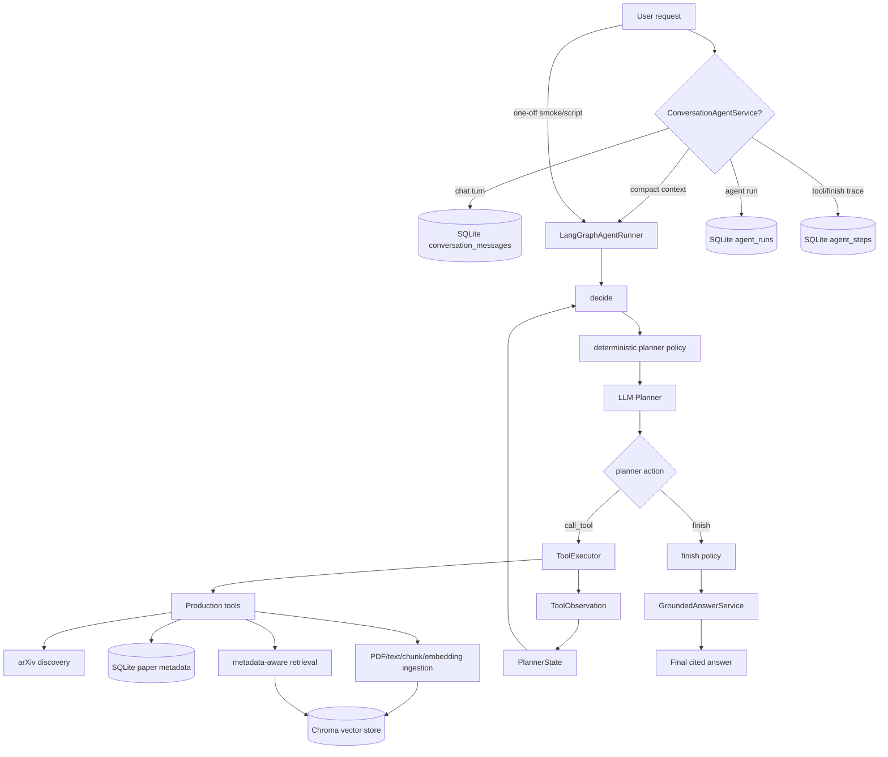

# Agentic AI Research Assistant

A Python research-assistant prototype with a LangGraph-orchestrated dynamic
planner. It can search arXiv, maintain a local paper knowledge base, prepare
papers for semantic retrieval, retrieve grounded evidence from indexed chunks,
and generate cited answers.

## Current Capabilities

- Live arXiv retrieval with stricter title/abstract queries and AI/ML/NLP category filters
- Optional LLM query planning for turning long user prompts into structured arXiv search terms
- Deduplication by `paper_id` or normalized title
- Hybrid relevance scoring:
  - BM25 lexical score
  - semantic similarity score
  - title/key phrase match score
  - recency score
  - hard/soft gates for topic-specific core signals such as RAG, RLHF, and RLVR
- Relevance filtering using final score and component scores
- OpenAI-backed abstract summaries with abstract fallback when the LLM call fails
- LangChain-backed default LLM generation with direct OpenAI/Gemini fallbacks
- Markdown report generation from selected papers
- SQLite metadata storage for seen/selected papers
- Local Chroma vector storage for full-paper RAG chunks
- Metadata-aware dense retrieval with hard filters and soft metadata hint reranking
- Knowledge-base tools for filtering seen papers, saving papers, and removing stored papers
- LangGraph dynamic planner runner with deterministic policy/recovery edges
- Persistent conversation threads, messages, and agent-run traces in SQLite
- Planner eval gate for freezing flow behavior before planner/tool changes
- Local BGE model path/offline loading support for stable retrieval runs
- Test coverage for state models, tools, runner workflows, arXiv parsing, scoring, LLM clients, and storage

## Project Layout

```text
app/
  agent/
    langgraph_runner.py       # LangGraph dynamic planner orchestration
    planner.py                # LLM one-step planner
    executor.py               # Production tool validation/execution
    observation_factory.py    # Tool result normalization for planner state
    planner_eval.py           # Deterministic planner flow evaluation gate
    runner.py                 # Legacy fixed workflow runner
    state.py                  # AgentState, Paper, PaperSummary, SearchPlan
  conversations/
    service.py                # Turn lifecycle: persist message, run graph, persist answer/trace
    sqlite_repository.py      # SQLite threads/messages/runs/steps store
    context_builder.py        # Compact conversation context for planner state
  llm/
    client.py                 # OpenAI/Gemini client wrappers
    fake_llm.py               # Test fake LLM
  storage/
    paper_store.py            # SQLite paper metadata store
  vectorstores/
    chroma_store.py           # Persistent local Chroma adapter
    metadata.py               # Retrieval metadata normalization/filter translation
  retrieval/
    retriever.py              # Metadata-aware semantic retriever
  services/
    chunk_indexing.py         # Chunk-to-vector-store ingestion service
  tools/
    arxiv_tools.py            # arXiv search and query building
    filter_relevant_papers.py # Relevance filtering
    knowledge_base_tools.py   # Save/filter/remove papers in SQLite
    llm_query_planner_tools.py
    llm_summary_tools.py
    report_tools.py
    scoring_tools.py
    registry.py
scripts/
  evaluate_dynamic_planner.py
  dynamic_planner_smoke_run.py
  conversation_smoke_run.py
  smoke_dynamic_existing_kb_answer.py
  smoke_dynamic_discover_prepare_answer.py
  smoke_dynamic_compare_report.py
  debug_scoring_run.py
  remove_papers_test.py
  test_openai_query_planner.py
  test_openai_summary.py
tests/
```

## API Server

Run the local FastAPI server:

```bash
uvicorn app.api:app --reload
```

Useful endpoints:

- `GET /health`
- `POST /chat`
- `GET /threads`
- `GET /threads/{thread_id}`
- `GET /threads/{thread_id}/messages`
- `GET /runs/{run_id}/steps`

Minimal chat request:

```bash
curl -X POST http://127.0.0.1:8000/chat \
  -H "Content-Type: application/json" \
  -d '{"message": "What are the main research directions in agentic RAG?"}'
```

Build and run with Docker:

```bash
docker build -t agentic-research-assistant .
docker run --rm -p 8000:8000 \
  --env-file .env \
  -v "$PWD/data:/app/data" \
  agentic-research-assistant
```

## System Flow



The important separation is:

- `PlannerState` is the live graph state for one run.
- `conversation_messages` stores user-facing chat turns.
- `agent_runs` and `agent_steps` store debugging and audit traces.
- `papers.sqlite3` stores paper metadata.
- Chroma stores chunk embeddings for semantic retrieval.

## Setup

```bash
python -m venv .venv
source .venv/bin/activate
pip install -r requirements.txt
```

For OpenAI-backed query planning and summaries, create a local `.env` file.
If `.env.example` is present, copy it; otherwise create `.env` manually:

```bash
cp .env.example .env  # optional helper if present
```

Then paste your key into `.env`:

```text
OPENAI_API_KEY="your_key_here"
LLM_PROVIDER=langchain_openai
```

The LLM clients load `.env` automatically. Do not commit API keys: `.env` is
ignored by git. Local data is written under `data/`, which is also ignored.

Supported `LLM_PROVIDER` values:

- `langchain_openai`: default generation backend using `langchain-openai`
- `openai`: direct OpenAI SDK backend
- `gemini`: Gemini SDK backend

## Run

Run the main research workflow:

```bash
python -m app.main
```

The current main flow:

1. `search_arxiv_papers`
2. `filter_seen_papers`
3. `deduplicate_papers`
4. `rank_papers_by_similarity`
5. `filter_relevant_papers`
6. `summarize_papers_with_llm`
7. `generate_report_from_abstracts`
8. `save_selected_papers_to_kb`

The output includes:

- final markdown report
- knowledge-base save report

## Dynamic LangGraph Planner

The dynamic planner path is now orchestrated by `LangGraphAgentRunner`.
LangGraph owns the flow, while the existing planner, executor, production tools,
observation normalization, finish policy, and grounded answer service keep their
existing responsibilities.

The core graph:

```text
decide
  ├─ CallToolAction -> execute_tool -> decide
  │                    └─ paper_not_retrievable
  │                       -> ensure_papers_retrievable
  │                       -> retry original retrieve_evidence
  │                       -> decide
  ├─ FinishAction   -> finish -> END
  ├─ max steps      -> max_steps -> END
  └─ failure        -> END
```

Run the deterministic planner gate before changing planner, policy, tool schema,
observation, or state-update behavior:

```bash
python -m scripts.evaluate_dynamic_planner
```

Run dynamic planner smoke scenarios one at a time:

```bash
python -m scripts.smoke_dynamic_existing_kb_answer
python -m scripts.smoke_dynamic_discover_prepare_answer
python -m scripts.smoke_dynamic_compare_report
```

Run a compact no-LLM retrieval smoke against local chunks:

```bash
python -m scripts.dynamic_planner_smoke_run \
  --fake-plan retrieve \
  --local-retrieval \
  --paper-id arxiv:2603.07379v1 \
  "agentic RAG research directions"
```

See also:

- `docs/langgraph_planner_flow.md`
- `docs/dynamic_planner_eval.md`
- `docs/conversation_persistence.md`

## Conversation Persistence

Conversation memory is stored separately from agent execution traces in
`data/metadata/conversations.sqlite3` by default. The conversation layer keeps
human-readable turns in `conversation_messages`, while planner/tool diagnostics
are stored under `agent_runs` and `agent_steps`.

Only compact context is sent back into the planner:

- the thread id, run id, and current user message id
- the rolling conversation summary
- the last few messages with safe structured metadata
- active paper ids extracted from message metadata

Run the local no-LLM conversation smoke:

```bash
python -m scripts.conversation_smoke_run
```

## Local Vector Store RAG

The project keeps two storage responsibilities separate:

- SQLite is the canonical paper metadata/history store. It remembers papers,
  topics, deduplication state, and selected/seen history.
- Chroma stores one vector record per chunk: the raw chunk document, the
  precomputed embedding from the existing BGE embedding layer, and a flat
  retrieval metadata projection.

The default persistent Chroma collection is `research_paper_chunks_v1` under
`data/vector_store/chroma`. Collection metadata validates the embedding model,
embedding dimension, distance metric, and metadata schema version so incompatible
vector spaces are not mixed silently.

Required chunk metadata includes `paper_id`, `knowledge_base_ids`, `source`,
`language`, `title`, `published_year`, `published_yyyymmdd`, `section`,
`section_group`, `chunk_type`, `chunk_index`, `word_count`, `text_source`,
`metadata_schema_version`, `embedding_model_id`, and `embedding_dimension`.
Semantic tag fields such as `topics`, `methods`, `datasets`, `tasks`, `models`,
and `evaluation_metrics` are normalized to lowercase snake case.

Retrieval uses:

- hard filters such as paper IDs, knowledge base IDs, source, section group, and
  date ranges inside the vector search scope;
- dense semantic search using query embeddings from the existing embedding layer;
- optional soft metadata hints that rerank candidates without excluding them.

Index selected paper chunks after chunking:

```bash
python -m scripts.vector_store_smoke_run
```

Search an existing embedding JSONL file directly:

```bash
python -m scripts.search_embeddings_run \
  --embeddings-path data/papers/arxiv_2601_17212v1/embeddings.jsonl \
  --query "query-aware diversity for retrieval augmented generation"
```

For code-level use, call `index_chunks(...)` from `app.services.chunk_indexing`
or `MetadataAwareRetriever.retrieve(...)` from `app.retrieval.retriever`. To
delete/reindex one paper, call `ChromaVectorStore.delete_by_paper(paper_id)` and
then index its chunks again. For a test reset, delete only the temporary Chroma
directory or use a new temporary path; do not call client-wide reset operations.

## Utility Scripts

Debug retrieval and scoring:

```bash
python -m scripts.debug_scoring_run
```

Test OpenAI query planning only:

```bash
python -m scripts.test_openai_query_planner
```

Test OpenAI summary only:

```bash
python -m scripts.test_openai_summary
```

Remove the latest saved RAG demo papers:

```bash
python -m scripts.remove_papers_test
```

Remove every paper from the local SQLite knowledge base:

```bash
python -m scripts.remove_papers_test --all
```

## Tests

Run all tests:

```bash
pytest
```

Current coverage includes:

- state and Pydantic model behavior
- LangGraph planner orchestration and deterministic recovery edges
- dynamic planner flow eval contracts
- arXiv XML parsing and query construction
- fake and live-tool-compatible workflows
- hybrid scoring and hard/soft relevance gates
- OpenAI/Gemini client wrappers
- LLM query planning and summary fallback behavior
- SQLite paper store save/filter/remove behavior
- registry and runner integration
- conversation repository, compact context building, and LangGraph conversation integration

## Notes

This is still a prototype, but it now has the core loop of a usable research
assistant: retrieve candidates, score them, filter them, summarize selected
papers, report results, and remember what has already been seen.
