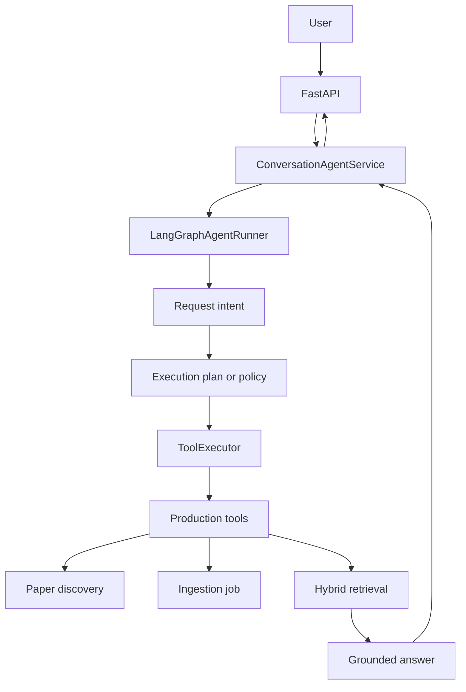

# Agentic AI Research Assistant

Small research-assistant project for searching papers, saving useful ones, and
asking grounded questions over the saved knowledge base.

The current version uses FastAPI, a simple chat UI, LangGraph orchestration, a
planner/tool layer, paper discovery, ingestion, hybrid retrieval, and grounded
answer generation.

## What It Can Do

- Search papers from arXiv and Semantic Scholar.
- Show discovered papers before saving them.
- Save selected papers into the local/cloud paper store.
- Prepare saved papers for RAG by fetching text, chunking, embedding, and indexing.
- Ask questions over indexed paper chunks.
- Keep multiple chat threads.
- Stream chat responses in the UI.
- Store runs and tool traces for debugging.
- Run locally with SQLite + Chroma.
- Run on cloud-style storage with Postgres + pgvector.
- Evaluate planner/retrieval/answer behavior with test and eval scripts.

## Quick Start

```bash
python -m venv .venv
source .venv/bin/activate
pip install -r requirements.txt
```

Create `.env`:

```text
OPENAI_API_KEY="your_key_here"
LLM_PROVIDER=langchain_openai

CONVERSATION_BACKEND=sqlite
PAPER_STORE_BACKEND=sqlite
VECTOR_STORE_BACKEND=chroma
INGESTION_JOB_BACKEND=memory

DATA_DIR=data
PAPERS_DIR=data/papers
CHROMA_PATH=data/vector_store/chroma
```

Run API + web UI:

```bash
uvicorn app.api:app --reload
```

Open:

```text
http://127.0.0.1:8000
```

API docs:

```text
http://127.0.0.1:8000/docs
```

## Docker

```bash
docker build -t agentic-research-assistant:local .
docker run --rm -p 8000:8000 \
  --env-file .env \
  -v "$PWD/data:/app/data" \
  agentic-research-assistant:local
```

Push to Docker Hub:

```bash
docker tag agentic-research-assistant:local khoatran1/agentic-research-assistant:latest
docker push khoatran1/agentic-research-assistant:latest
```

## Cloud Storage Settings

Local default:

```text
CONVERSATION_BACKEND=sqlite
PAPER_STORE_BACKEND=sqlite
VECTOR_STORE_BACKEND=chroma
INGESTION_JOB_BACKEND=memory
```

Cloud-style setup:

```text
CONVERSATION_BACKEND=postgres
PAPER_STORE_BACKEND=postgres
VECTOR_STORE_BACKEND=pgvector
INGESTION_JOB_BACKEND=postgres
DATABASE_URL=postgresql+psycopg://...
PGVECTOR_TABLE_NAME=research_paper_vectors
```

Notes:

- Postgres stores conversations, runs, paper metadata, and ingestion job status.
- pgvector stores chunk embeddings.
- PDF/text artifacts still live under `PAPERS_DIR`, so production should mount
  persistent storage or move artifacts to S3/EFS later.

## Main Flow


```mermaid
flowchart TD
    user[User] --> api[FastAPI]
    api --> service[ConversationAgentService]
    service --> runner[LangGraphAgentRunner]
    runner --> intent[Request intent]
    intent --> plan[Execution plan or policy]
    plan --> executor[ToolExecutor]
    executor --> tools[Production tools]
    tools --> discovery[Paper discovery]
    tools --> ingest[Ingestion job]
    tools --> retrieval[Hybrid retrieval]
    retrieval --> answer[Grounded answer]
    answer --> service
    service --> api
```

In normal words:

1. `app/api.py` receives a chat request.
2. `ConversationAgentService` stores the user message and starts a run.
3. `LangGraphAgentRunner` controls the graph.
4. The request is classified into intent.
5. The runner chooses a deterministic plan or an LLM plan.
6. `ToolExecutor` validates and runs production tools.
7. Tool observations update `PlannerState`.
8. Retrieval coverage is checked before answering.
9. The answer service generates the final grounded response.

## Files Worth Reading First

```text
app/api.py
app/conversations/service.py
app/agent/langgraph_runner.py
app/agent/planner_state.py
app/agent/request_intent.py
app/agent/execution_router.py
app/agent/execution_plan.py
app/agent/planner_policy.py
app/agent/executor.py
app/agent/tool_catalog.py
app/agent/tool_spec.py
app/tools/production/
app/workflows/
app/retrieval/
app/storage/
```

## Useful Commands

Run all tests:

```bash
pytest -q
```

Run planner behavior eval:

```bash
python -m scripts.evaluate_dynamic_planner
```

Run compact agent eval:

```bash
python evaluate.py
```

Manual dynamic planner smoke:

```bash
python -m scripts.dynamic_planner_smoke_run \
  "Find 3 recent papers about agentic RAG and summarize them."
```

Health checks:

```bash
curl http://127.0.0.1:8000/health
curl http://127.0.0.1:8000/ready
```

## Current Limitations

- Background ingestion is in-process. Job status can be persisted, but this is
  not yet a full SQS/Celery-style worker system.
- Artifacts still use filesystem paths.
- RAG quality depends heavily on chunking, retrieval settings, and the saved
  paper set.
- The UI is intentionally simple.

## Test Status

Latest checked locally:

```text
pytest -q                              317 passed
python -m scripts.evaluate_dynamic_planner  5/5 passed
python evaluate.py                     passed=2 failed=0
```
